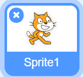
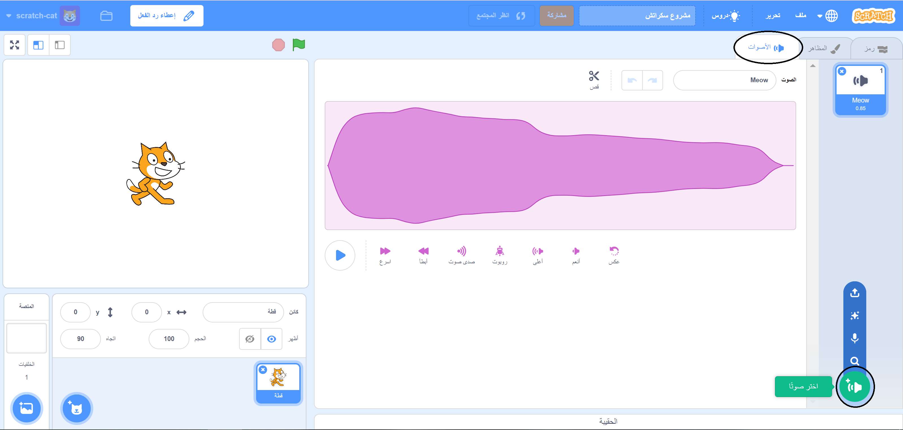
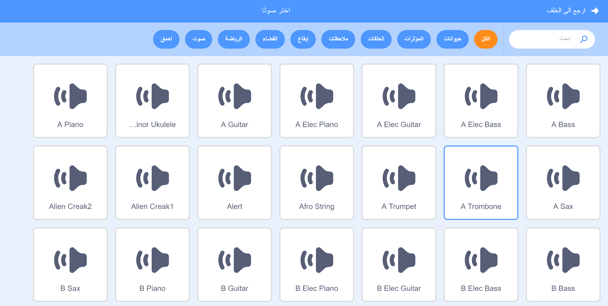
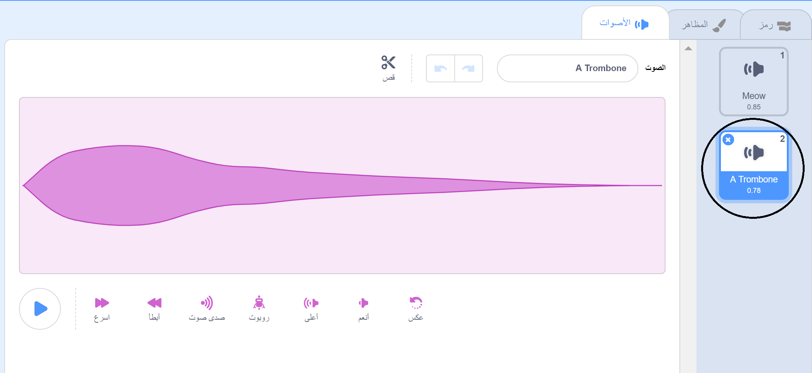

+ حدِّد الكائن الذي تريد إضافة صوت إليه.

+ انقر فوق علامة تبويب **الأصوات**، ثم انقر فوق **اختيار صوت**:

+ الأصوات منظمة حسب الفئة، ويمكنك تمرير (الفأره) فوق الرمز لسماع الصوت. اختر الصوت المناسب.

+ ستجد عندئذٍ أنه أصبح للكائن الصوت الذي اخترتَه.

