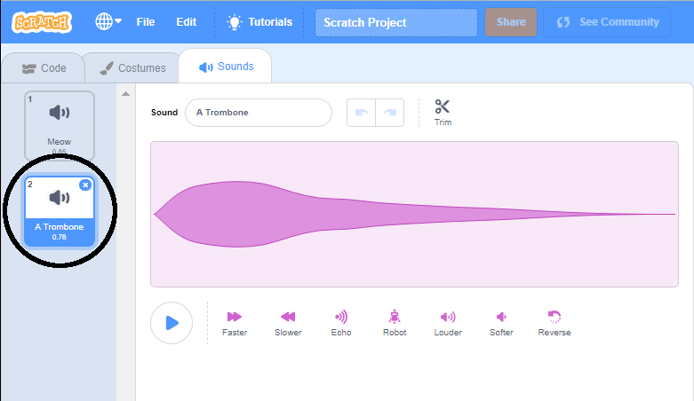

+ আপনি যে sprite টিতে শব্দটি যুক্ত করতে চান তা নির্বাচন করুন।.

+ ক্লিক করুন **Sounds** ট্যাব, এবং ক্লিক করুন **Choose a Sound**:

+ শব্দগুলি বিভাগ অনুসারে সংগঠিত হয় এবং আপনি শব্দ শোনার জন্য আইকনটিতে ঘুরে আসতে পারেন।. একটি উপযুক্ত শব্দ চয়ন করুন।.

+ তারপরে আপনার sprite এ আপনার নির্বাচিত শব্দ রয়েছে কিনা তা দেখতে হবে।.

