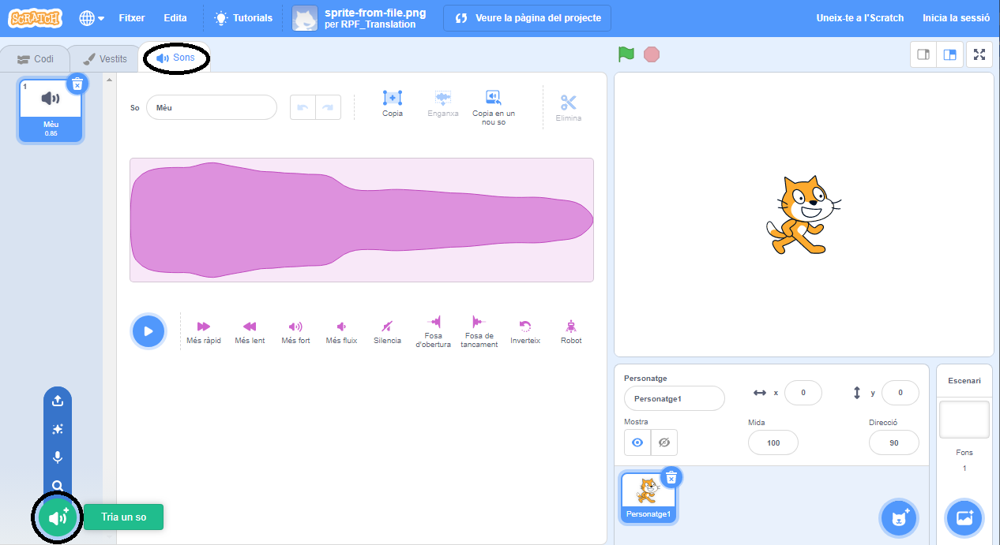
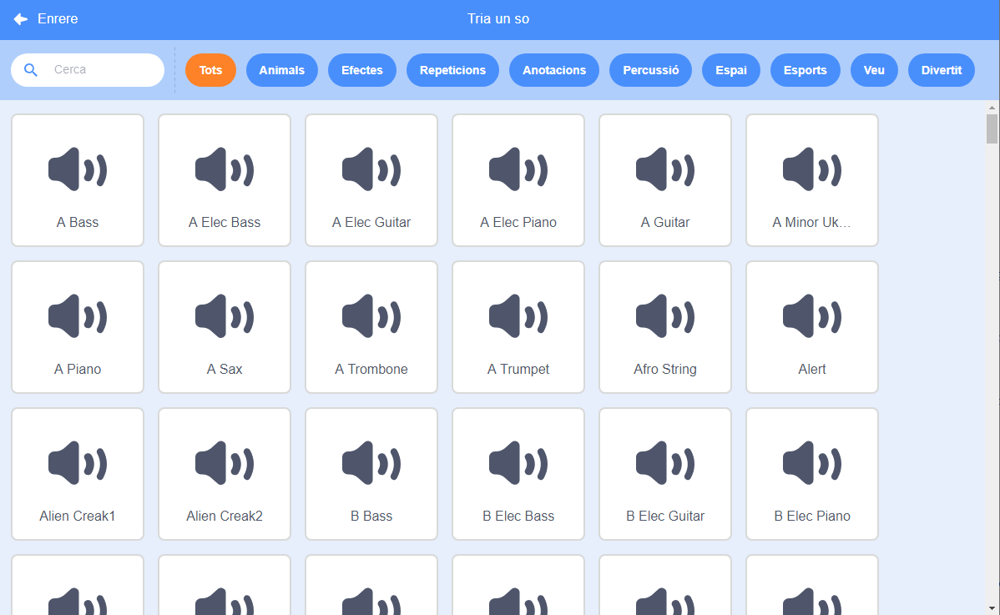
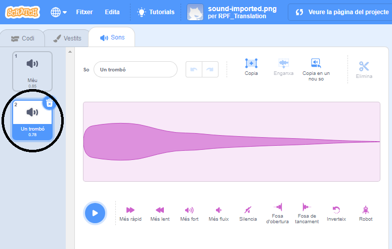

+ Selecciona el personatge que vols afegir el so.

+ Fes clic a la pestanya **sons**, i fes clic a **Tria un so**:

+ Els sons s'organitzen per categoria, i pots passar el cursor per sobre de la icona per escoltar un so. Tria un so adient.

+ A continuació, has de veure que el teu personatge té el so que has triat.

