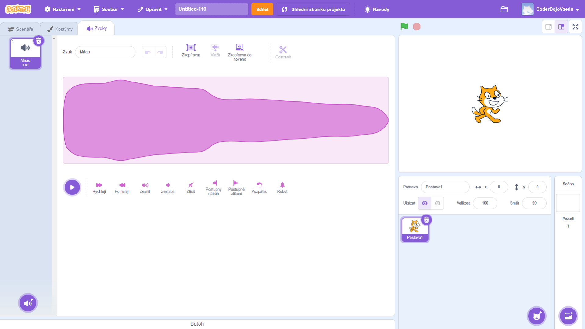
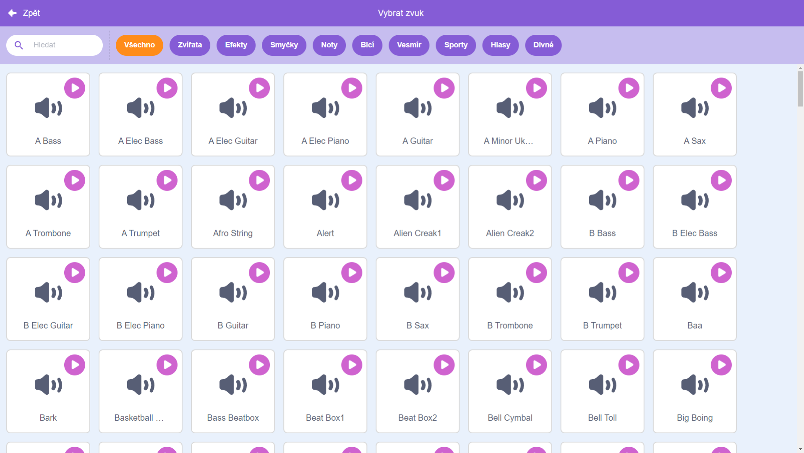
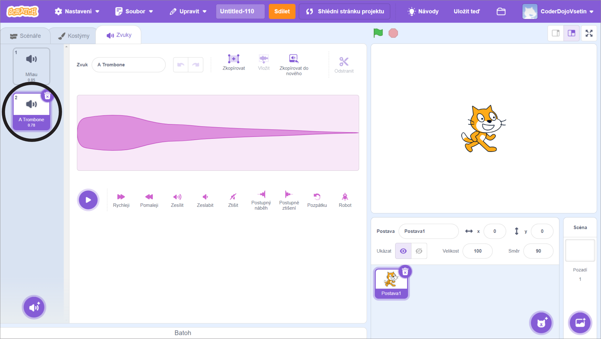

+ Vyberte postavu, ke které chcete přidat zvuk.

+ Klepněte na kartu **Zvuky** a klepněte na tlačítko **Vyber zvuk**:

+ Zvuky jsou uspořádány podle kategorií, najetím ukazatele myši na ikonu si zvuk můžete poslechnout. Vyberte vhodný zvuk.

+ U vaší postavy byste nyní měli zvolený zvuk vidět.

