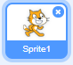
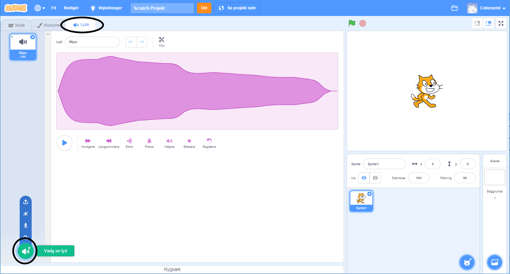
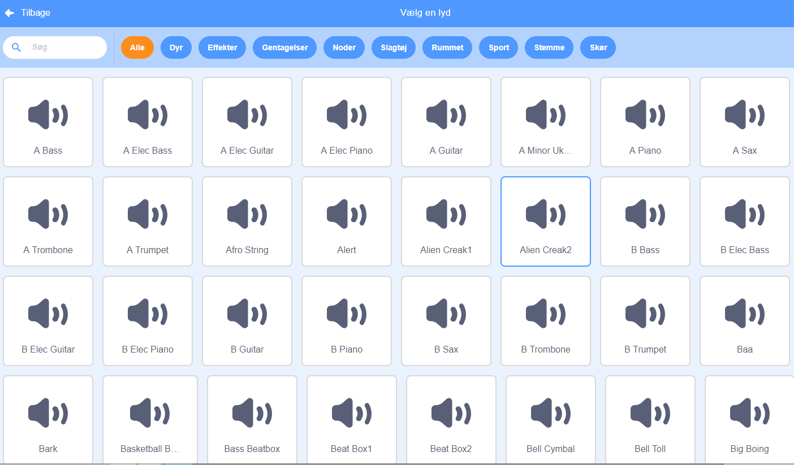
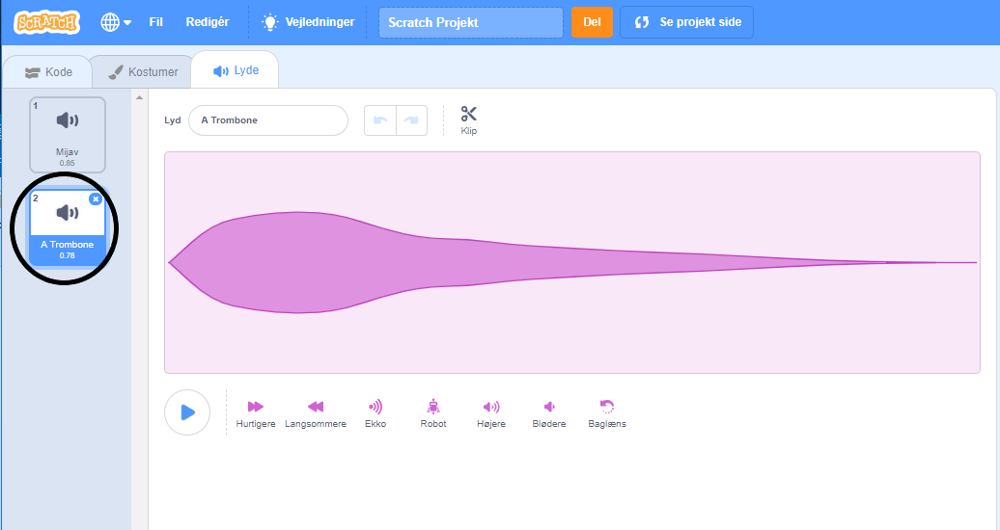

+ Vælg den sprite du vil tilføje lyden.

+ Click the **Sounds** tab, and click **Choose a Sound**:

+ Sounds are organised by category, and you can hover over the icon to hear a sound. Choose a suitable sound.

+ Du kan så se, hvilke lyd der er valgt til din sprite.

