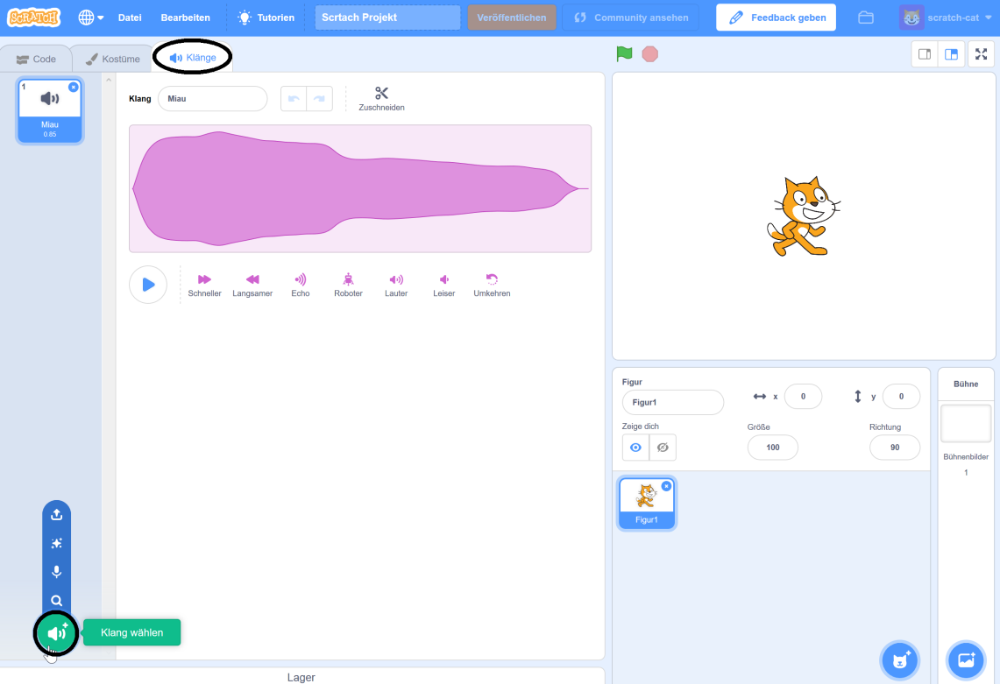

+ Wähle die Figur aus, der du den Klang hinzufügen möchtest.

+ Klicke den **Klänge** Reiter und klicke **Klang wählen**:

+ Die Klänge sind nach Kategorien geordnet und du kannst mit der Maus über das Symbol fahren, um einen Klang zu hören. Wählen Sie einen passenden Klang.

+ Du solltest dann sehen, dass deine Figur den von dir gewählten Klang besitzt.

