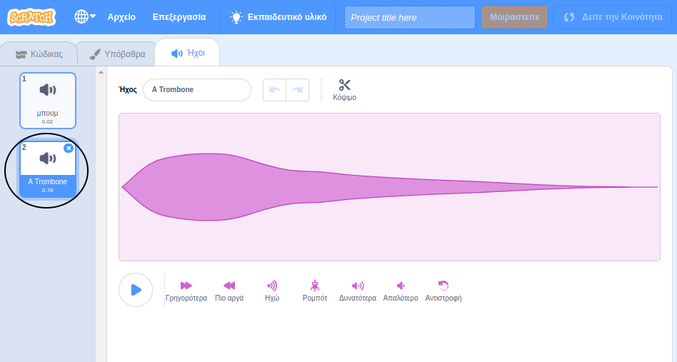

+ Επέλεξε το αντικείμενο στο οποίο θέλεις να προσθέσεις τον ήχο.

+ Κάνε κλικ στην καρτέλα **Ήχοι** και ξανά κλικ στο **Επιλέξτε Ήχο**:

+ Οι ήχοι χωρίζονται σε κατηγορίες. Μπορείς να αφήσεις το δείκτη του ποντικιού πάνω στο εικονίδιο ενός ήχου για να τον ακούσεις. Επέλεξε τον κατάλληλο ήχο.

+ Στη συνέχεια, θα πρέπει να δεις ότι το αντικείμενο έχει τον επιλεγμένο ήχο.

