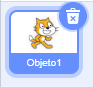
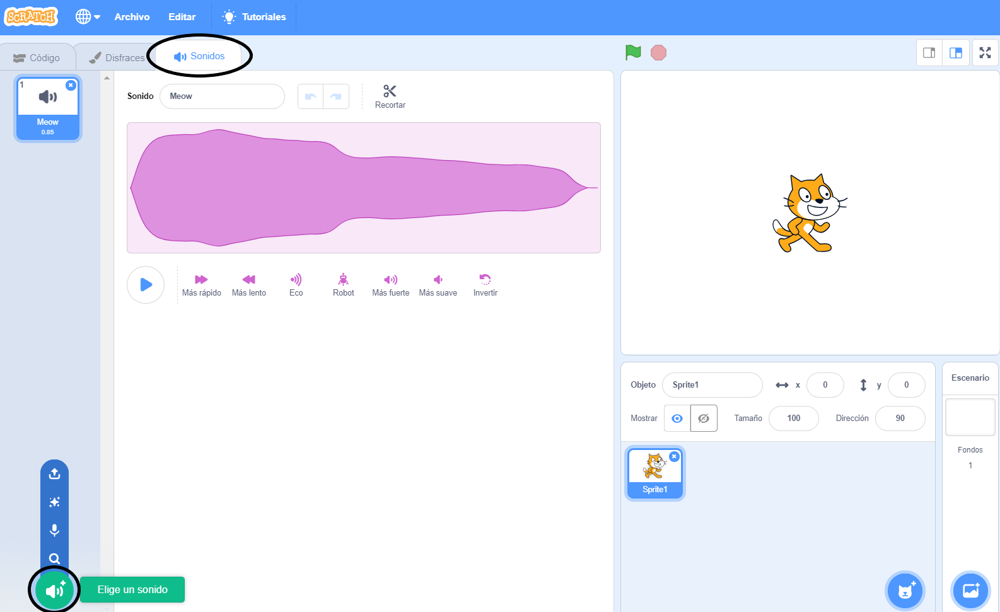
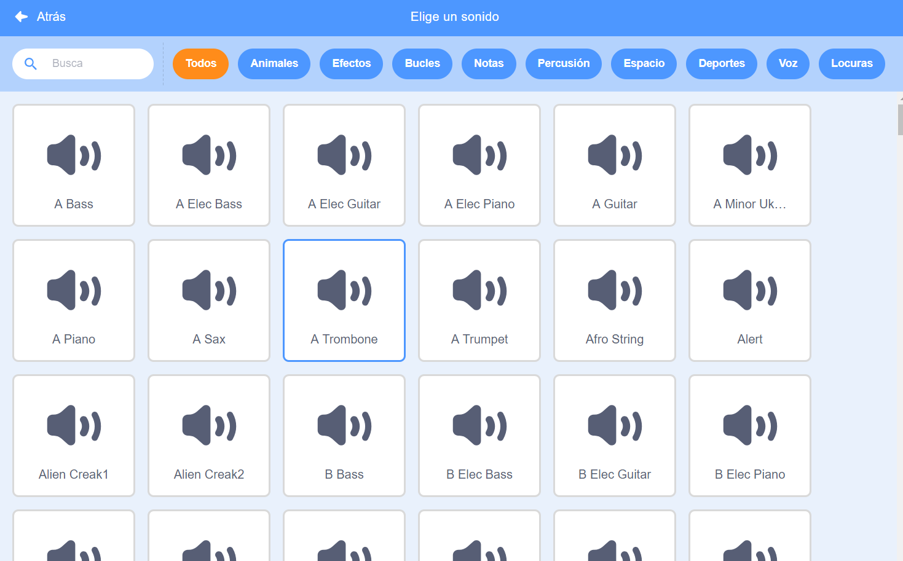
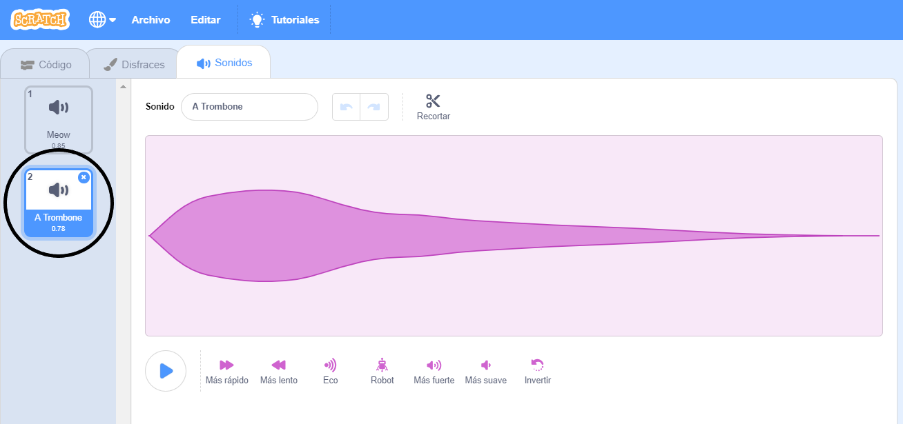

+ Selecciona el objeto al que deseas añadir el sonido.

+ Haz clic en la pestaña de **Sonidos**, y después en **Elige un sonido**:

+ Los sonidos están organizados por categoría. Puedes desplazar el cursor sobre el icono de un sonido para escucharlo. Elige un sonido adecuado.

+ Deberías ver que tu objeto tiene el sonido que has elegido.

