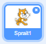
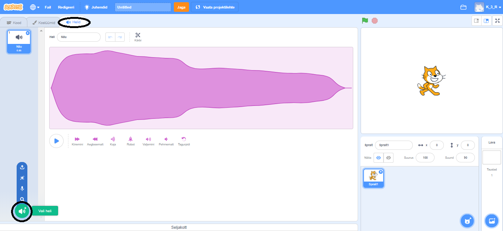
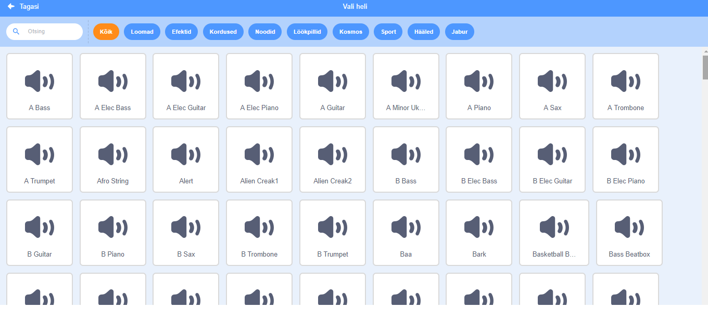
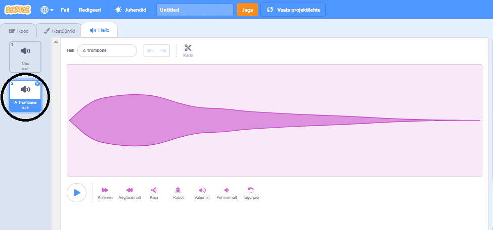

+ Vali sprait, millele soovid heli lisada.

+ Kliki vahekaardil **Helid** ja kliki **Vali heli**:

+ Helid on liigitatud kategooriate järgi ja heli kuulmiseks saad noolega ikoonile liikuda. Vali sobiv heli.

+ Seejärel peaksid nägema, et sinu spraidil on sinu valitud heli.

