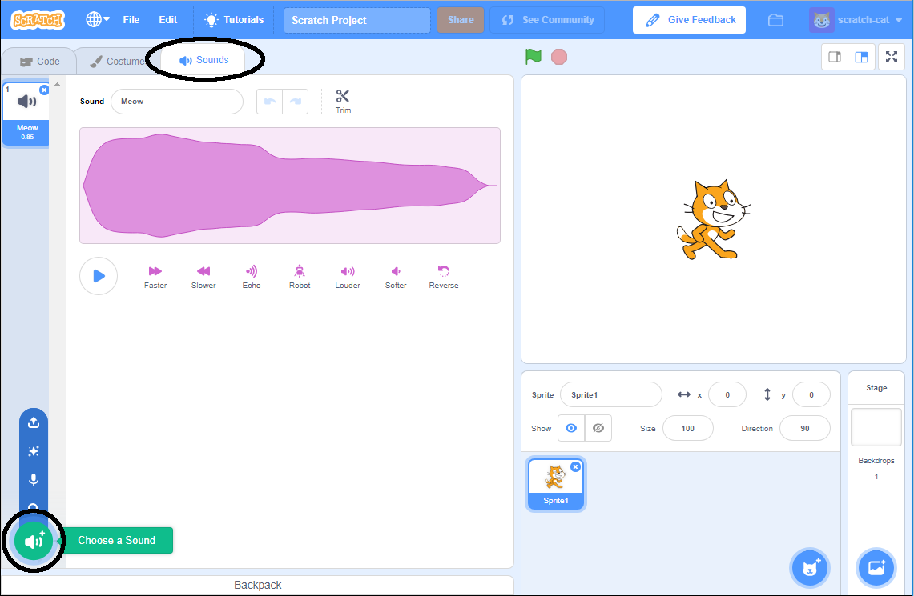

+ شبحی که می‌خواهید صدا را به آن اضافه کنید، انتخاب نمایید.

+ روی زبانه‌ی **Sounds** کلیک کنید و بر روی **Choose a Sound** کلیک نمایید:

+ صداها براساس دسته‌بندی مرتب شده‌اند و می‌توانید بر روی آیکن بروید تا صدا را بشنوید. صدای مناسب را انتخاب کنید.

+ پس از آن می‌توانید ببینید که شبح شما دارای صدای انتخابی شما است.

