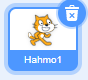
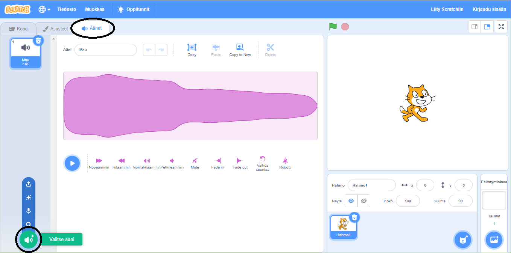
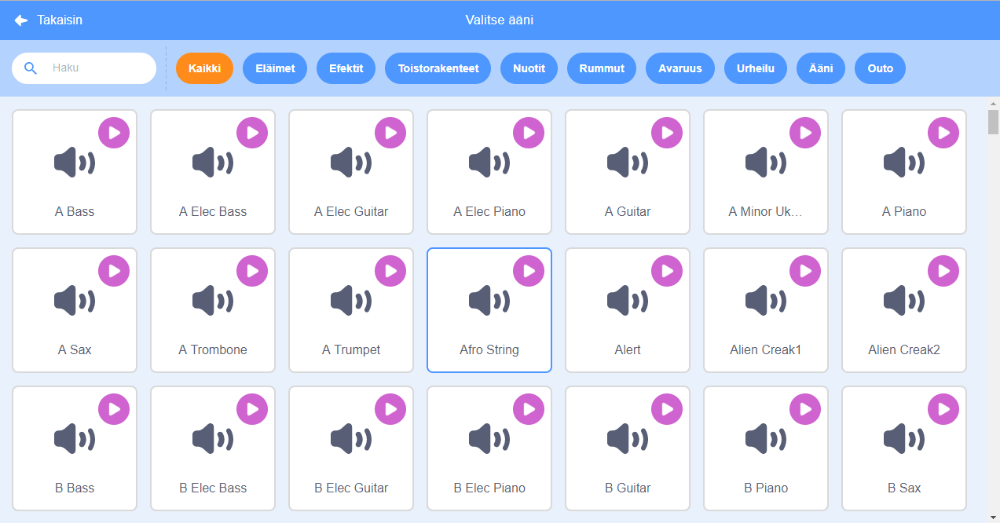
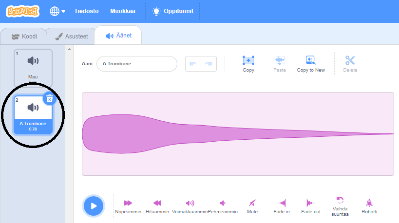

+ Valitse hahmo, johon haluat lisätä äänen.

+ Napsauta **Äänet**-välilehteä ja sitten **Valitse Ääni**:

+ Äänet on järjestetty luokittain, ja voit osoittaa kuvakkeen päälle äänen kuulemiseksi. Valitse sopiva ääni.

+ Sinun pitäisi sitten nähdä, että hahmollasi on valitsemasi ääni.

