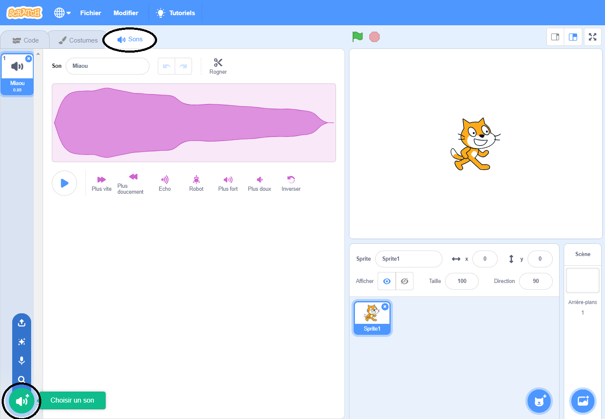
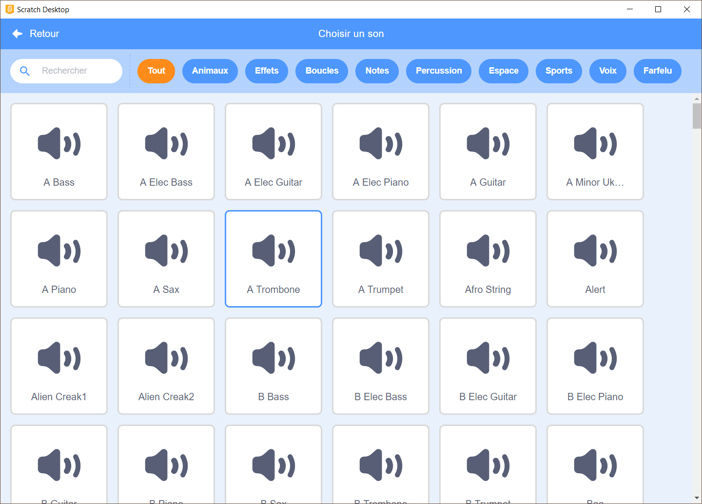
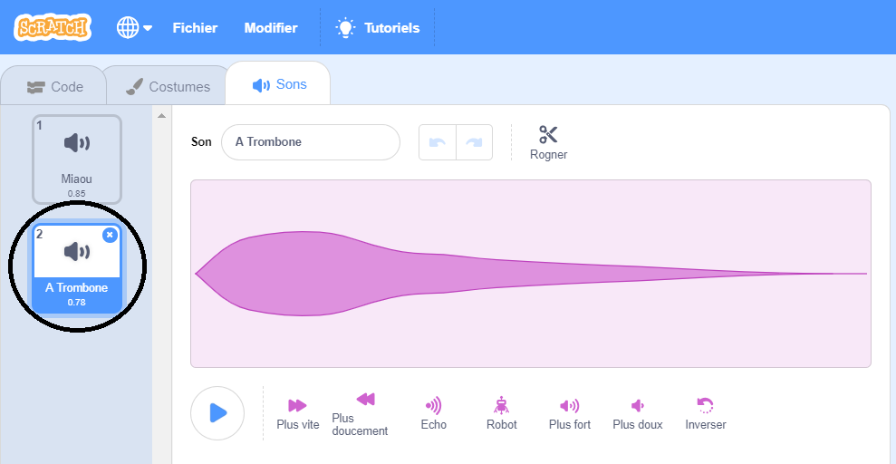

+ Sélectionne le lutin auquel tu souhaite ajouter un son.

+ Click the **Sounds** tab, and click **Choose a Sound**:

+ Sounds are organised by category, and you can hover over the icon to hear a sound. Choose a suitable sound.

+ Tu verras alors que ton lutin fait le son que tu as choisi.

