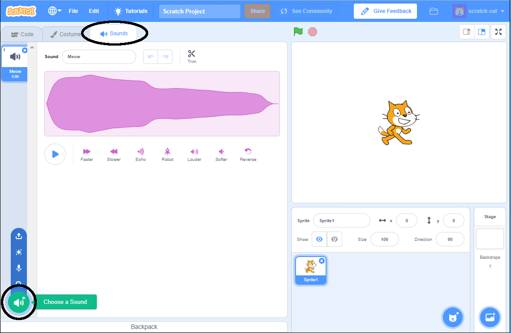

+ उस स्प्राइट को चुनें जिसमें आप आवाज़ जोड़ना चाहते हैं।

+ **Sounds** टैब पर क्लिक करें, और फिर **Choose a sound** पर क्लिक करें:

+ आवाज़ें श्रेणी के अनुसार व्यवस्थित की जाती हैं, और आप आवाज़ सुनने के लिए उसी आइकन पर माउस मंडरा सकते हैं। एक उपयुक्त आवाज़ चुनें।

+ इसके बाद आपको दिखेगा कि आपके स्प्राइट में आपके द्वारा चुनी गई आवाज़ जुड़ गई है।

