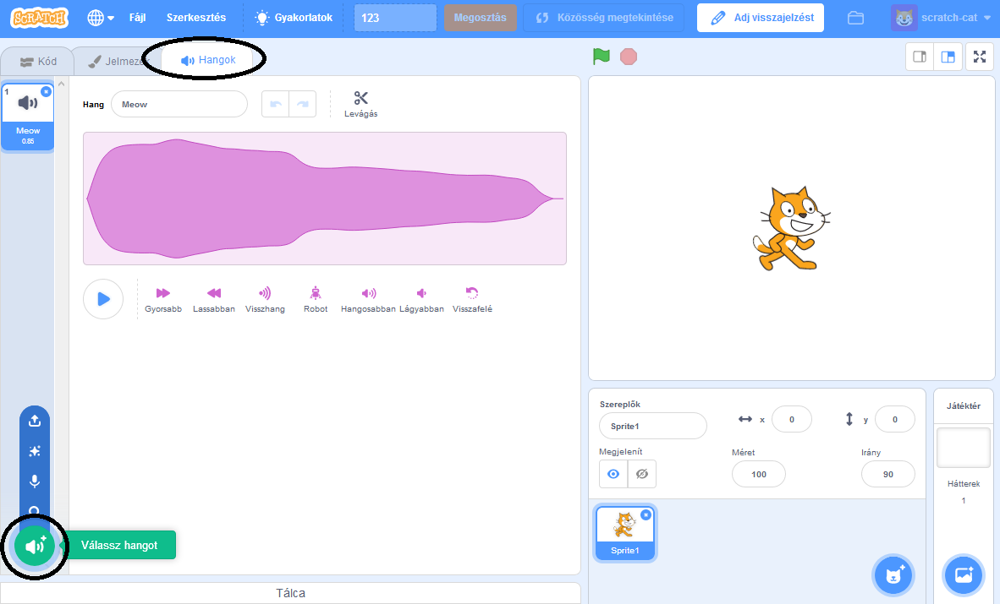
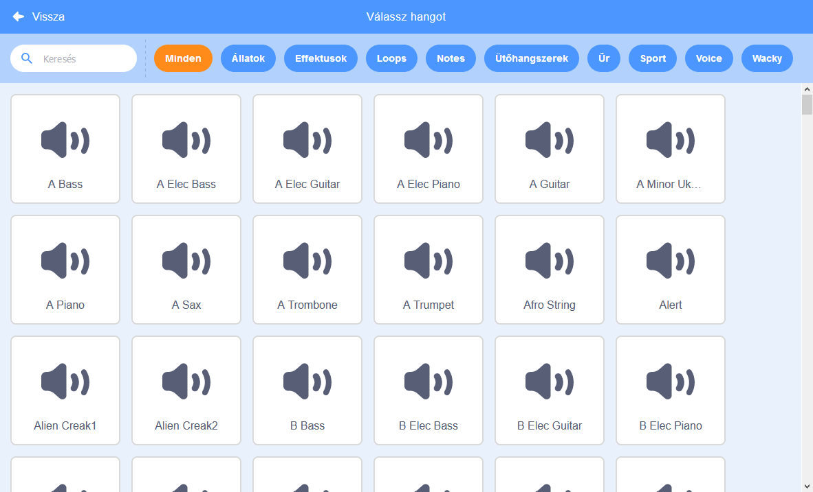
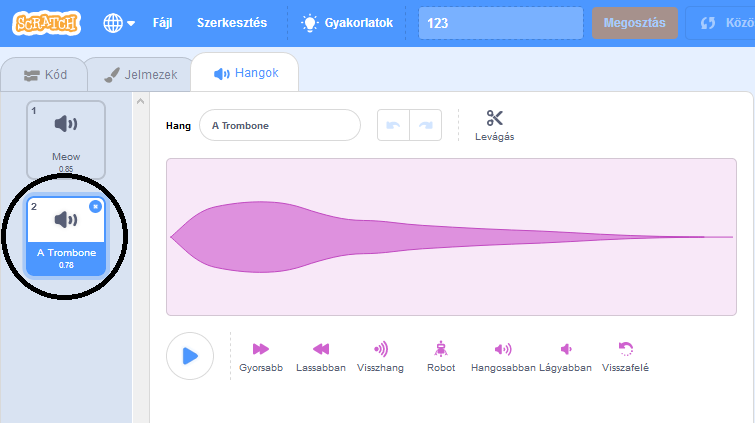

+ Válaszd ki a szereplőt, amelyhez hozzá szeretnéd adni a hangot.

+ Kattints a **Hangok** lapra, majd kattints a **Válassz hangot** ikonra:

+ A hangok kategóriák szerint vannak rendezve, és az egeret az ikon fölé húzva meghallgathatod a hangot. Válassza ki a megfelelő hangot.

+ Ezután láthatod, hogy a szereplőhöz hozzákerült a kiválasztott hang.

