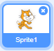

+ Válaszd ki a szereplőt, amelyhez hozzá szeretnéd adni a hangot.

+ Click the **Sounds** tab, and click **Choose a Sound**:

+ Sounds are organised by category, and you can hover over the icon to hear a sound. Choose a suitable sound.

+ Ezután láthatod, hogy a szereplőhöz hozzákerült a kiválasztott hang.

