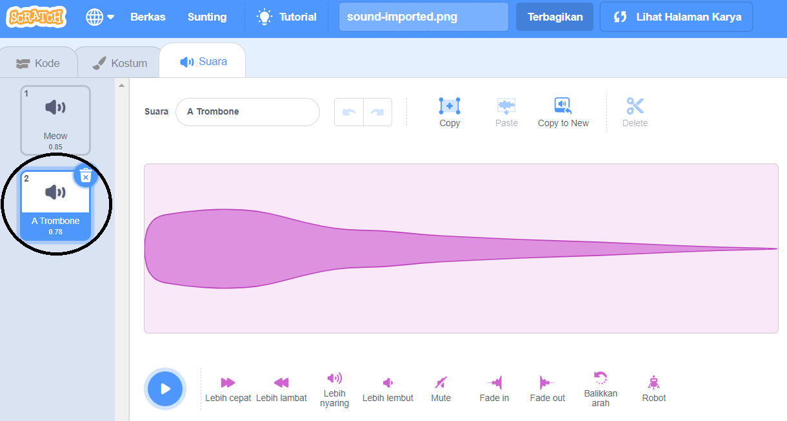

+ Pilih sprite yang ingin Kamu tambahkan suara.

+ Kilk tab **Suara**, kemudian klik **Pilih Suara**:

+ Suara di susun berdasarkan kategori, dan kamu bisa mengarahkan kursor mouse ke icon untuk mendengar suara. Pilih suara yang cocok.

+ Kamu kemudian akan melihat bahwa sprite Kamu telah memiliki suara yang Kamu pilih.

