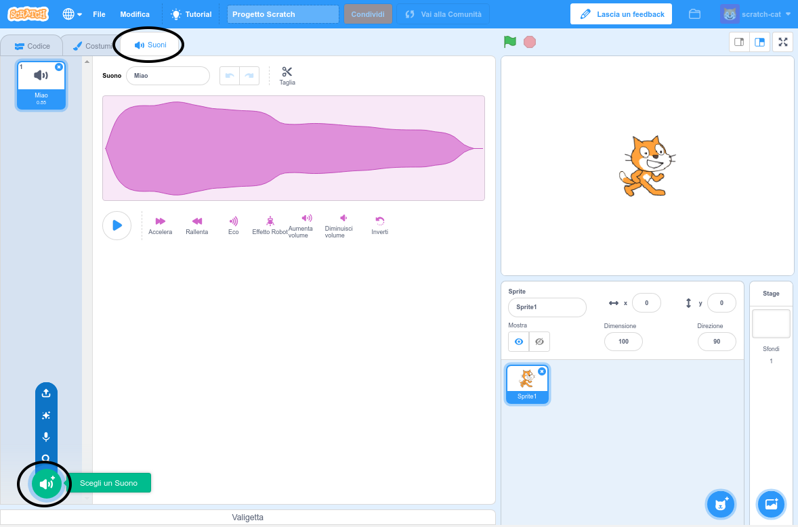
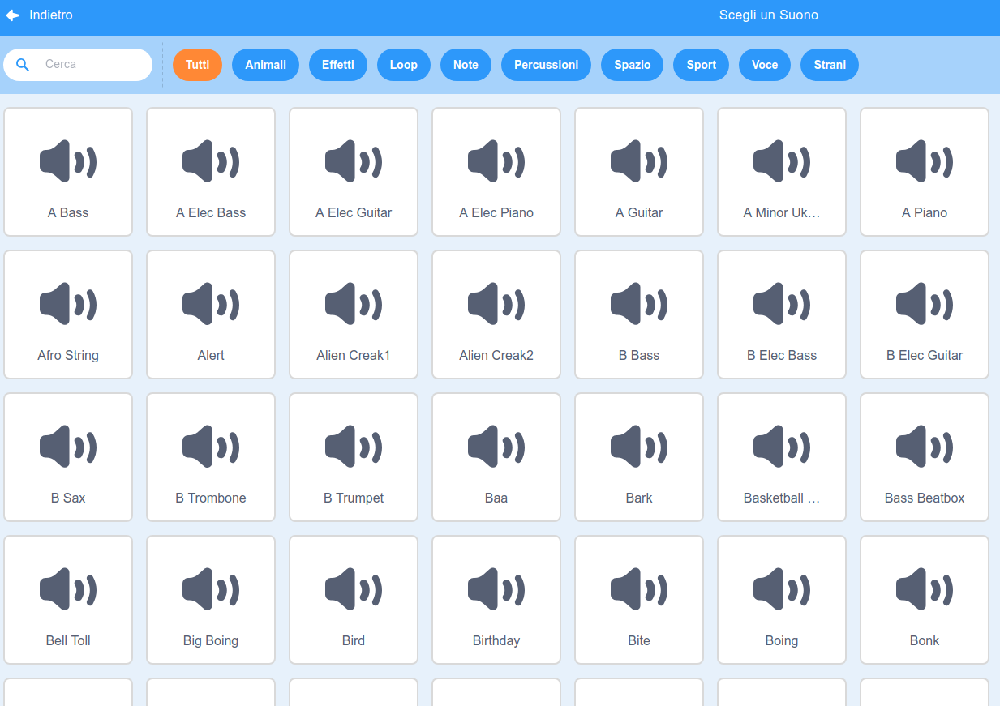
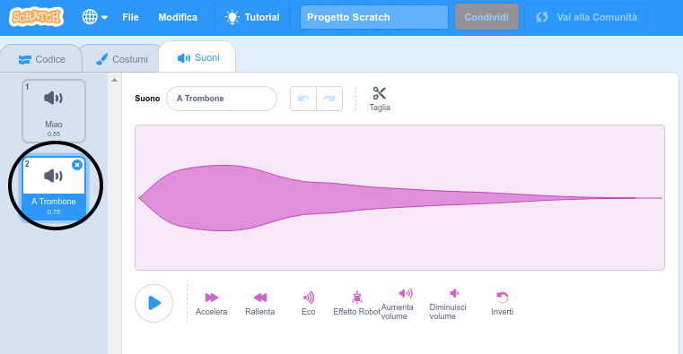

+ Seleziona lo sprite a cui vuoi aggiungere il suono.

+ Click the **Sounds** tab, and click **Choose a Sound**:

+ Sounds are organised by category, and you can hover over the icon to hear a sound. Choose a suitable sound.

+ Dovresti poter vedere che il tuo sprite ha il suono che hai scelto.

