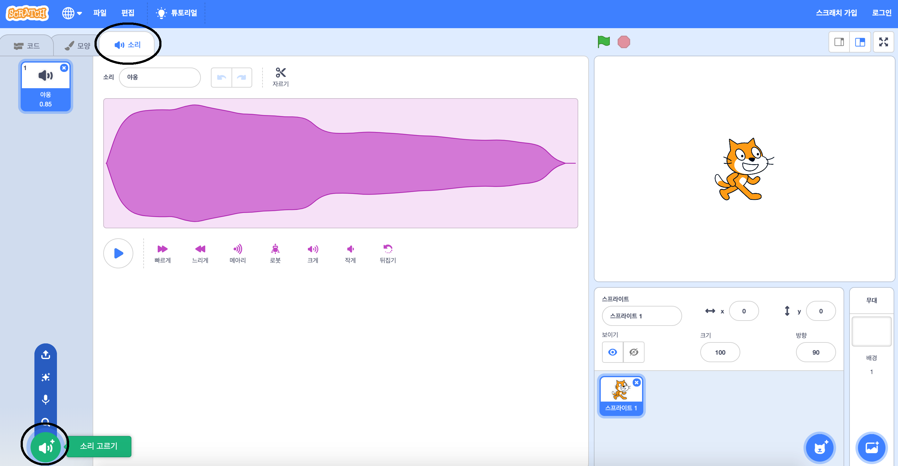

+ 소리를 추가할 스프라이트를 선택하세요.

+ **소리** 탭을 클릭하고 **소리 고르기** 를 클릭하세요.

+ 소리는 카테고리별로 구성되어 있으며, 마우스 커서를 아이콘 위에 놓으면 소리를 들을 수 있습니다. 어울리는 소리를 선택하세요.

+ 스프라이트에 선택한 소리가 있음을 확인할 수 있을 겁니다.

커뮤니티 기여 번역

이 프로젝트는 강태원 가 번역하였고 홍주희 가 검토하였습니다.

우리의 놀라운 번역 자원 봉사자들은 전 세계의 어린이들에게 코딩을 배울 수 있는 기회를 제공합니다. 우리 프로젝트 번역에 참여하여 더 많은 아이들에게 도움을 줄 수 있습니다. 자세한 내용은 [rpf.io/translators](https://rpf.io/translators)에서 확인하세요.