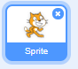
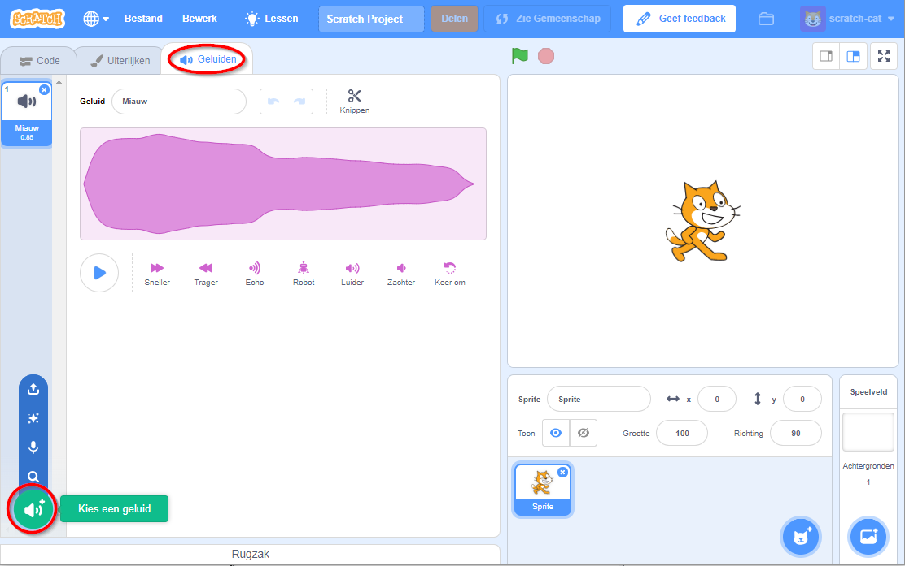
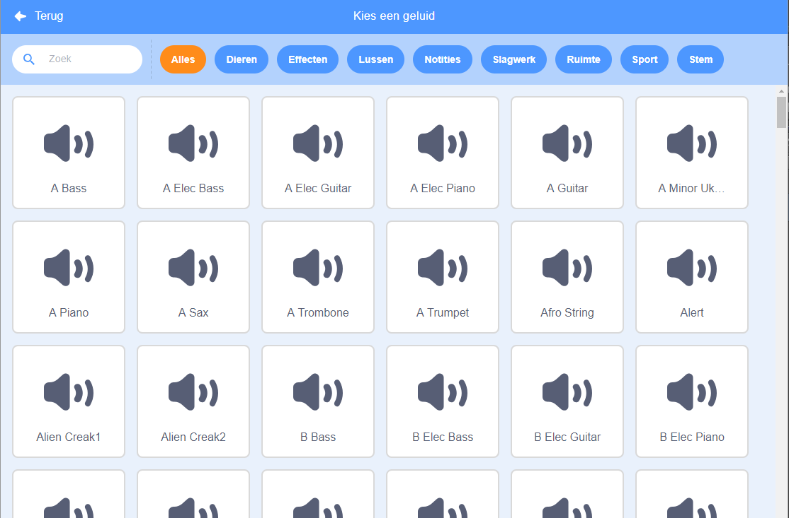
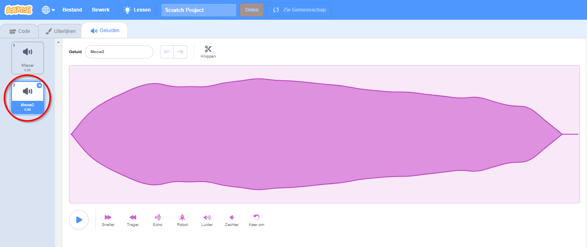

+ Selecteer de sprite waaraan je het geluid wilt toevoegen.

+ Klik op het tabblad **Geluiden** en klik linksonder op **Kies een geluid**:

+ Geluiden zijn ingedeeld per categorie, je kunt over het pictogram bewegen om een ​​geluid te horen. Kies een geschikt geluid.

+ Je zou dan moeten zien dat het gekozen geluid is toegevoegd aan je sprite.

