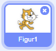
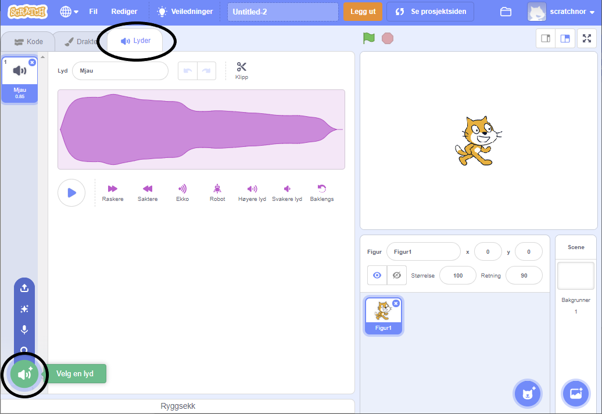
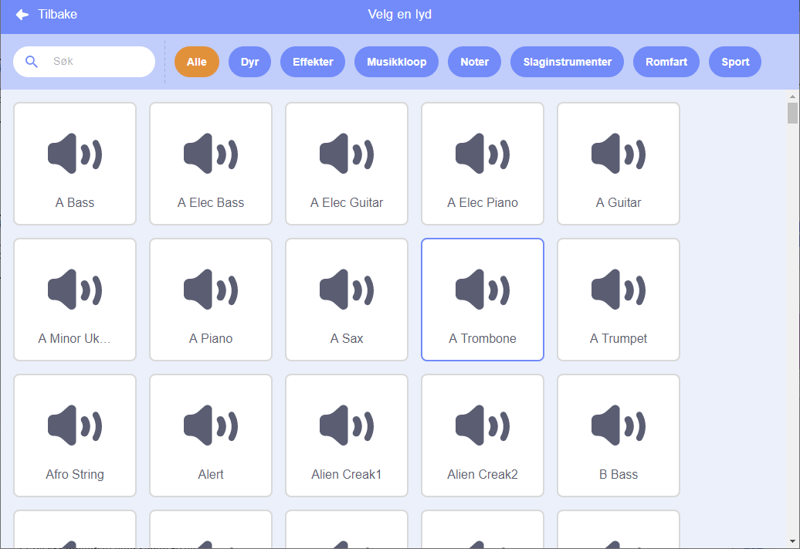
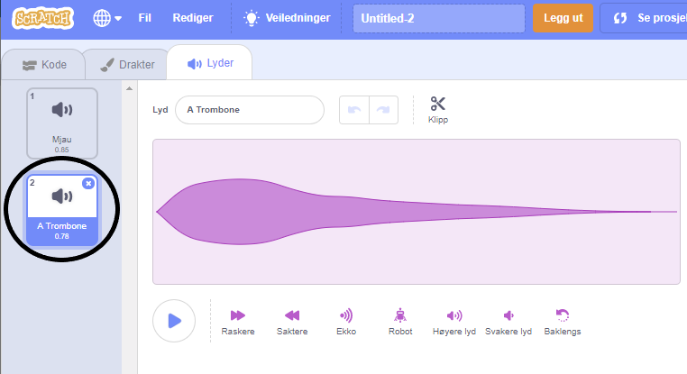

+ Velg figuren du vil legge til lyden på.

+ Klikk på arkfanen **Lyder**, og klikk på **Velg en lyd**:

+ Lyder er sortert etter kategori, og du kan holde musepekeren over ikonet for å høre på en lyd. Velg en passende lyd.

+ Du bør nå se at figuren har din valgte lyd.

