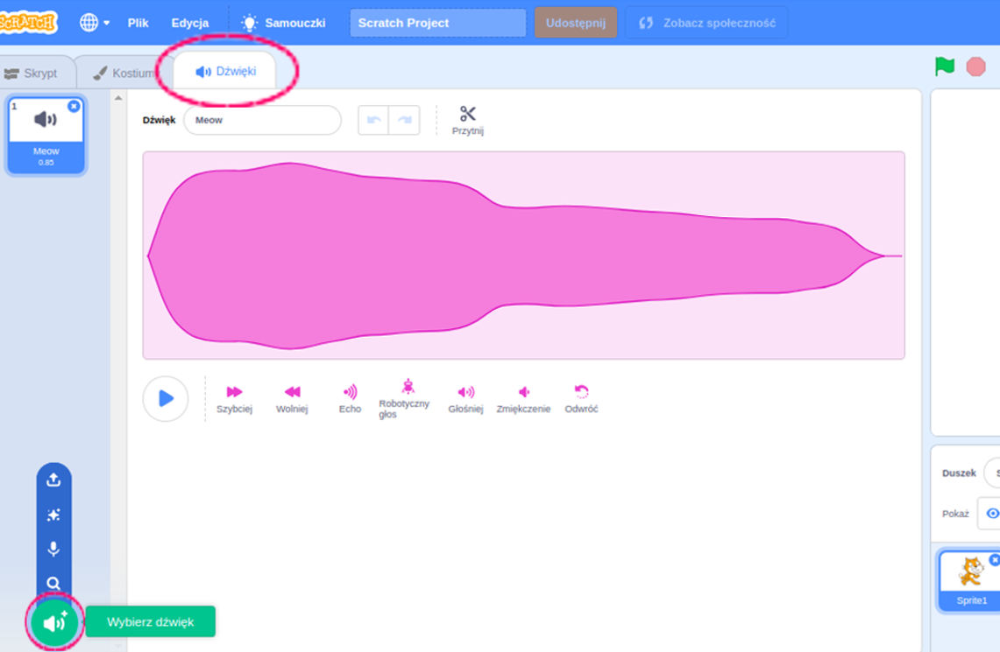
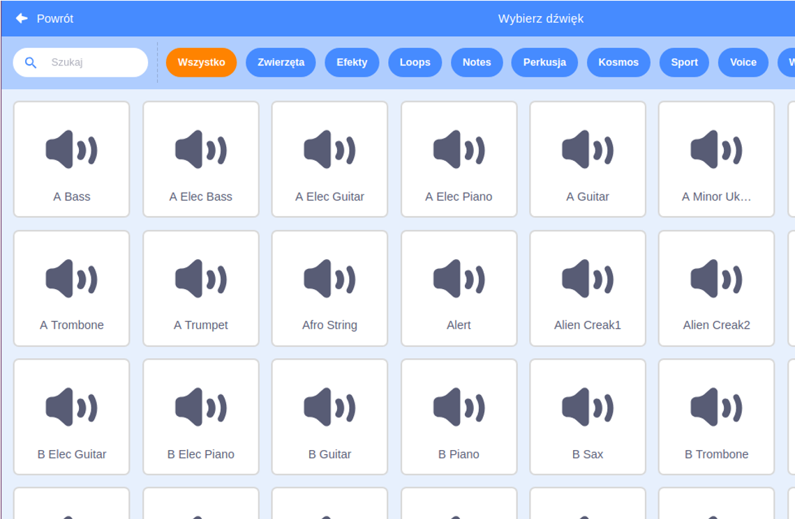
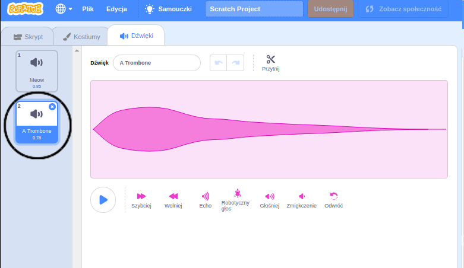

+ Wybierz duszka, do którego chcesz dodać dźwięk.

+ Kliknij kartę **Dźwięki**, a następnie **Wybierz dźwięk**:

+ Dźwięki są uporządkowane według kategorii i możesz najechać kursorem na ikonę, aby odsłuchać dźwięk. Wybierz pasujący dźwięk.

+ Zauważysz wtedy, że twój duszek ma wybrany przez ciebie dźwięk.

