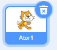
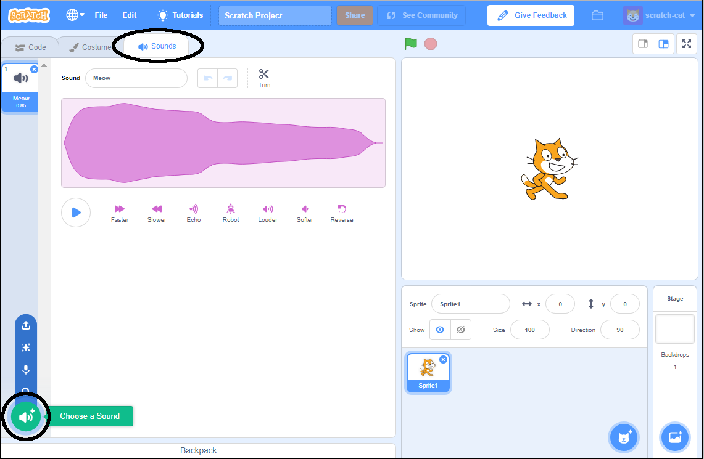
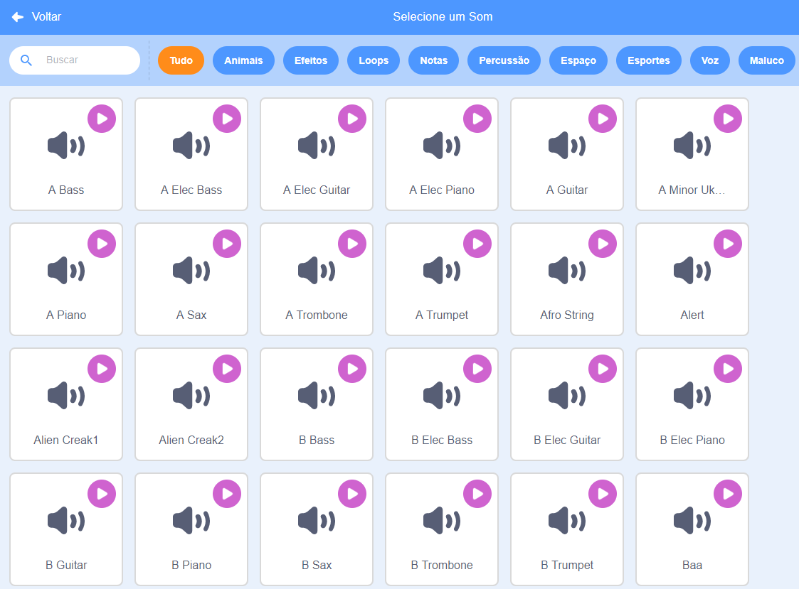
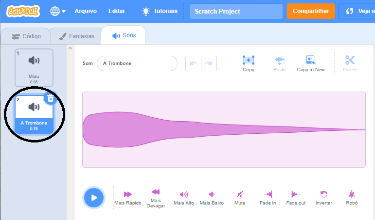

+ Selecione o ator ao qual deseja adicionar o som.

+ Clique na aba **Sons** e clique **Escolha um som**:

+ Os sons estão organizados por categoria e você pode passar o mouse sobre o ícone para ouvir um som. Escolha um som adequado.

+ Você deve então ver que seu ator possui o som escolhido.

