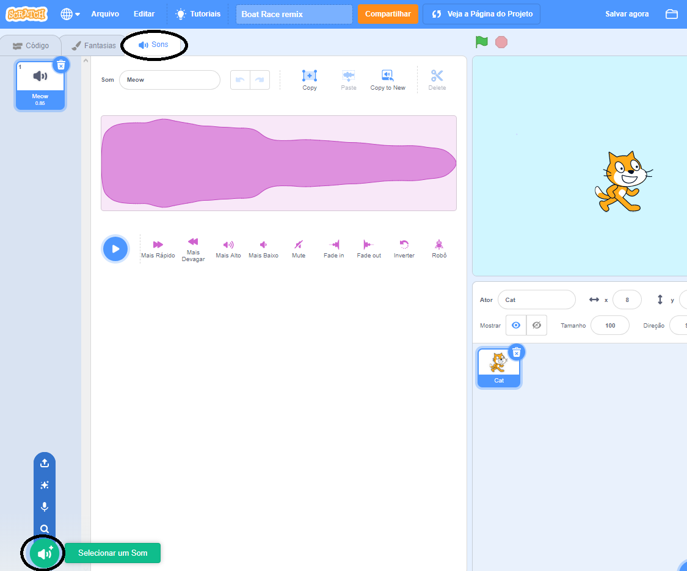

+ Selecione o ator ao qual deseja adicionar o som.

+ Click the **Sounds** tab, and click **Choose a Sound**:

+ Sounds are organised by category, and you can hover over the icon to hear a sound. Choose a suitable sound.

+ Você deve então ver que seu ator possui o som escolhido.

