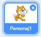
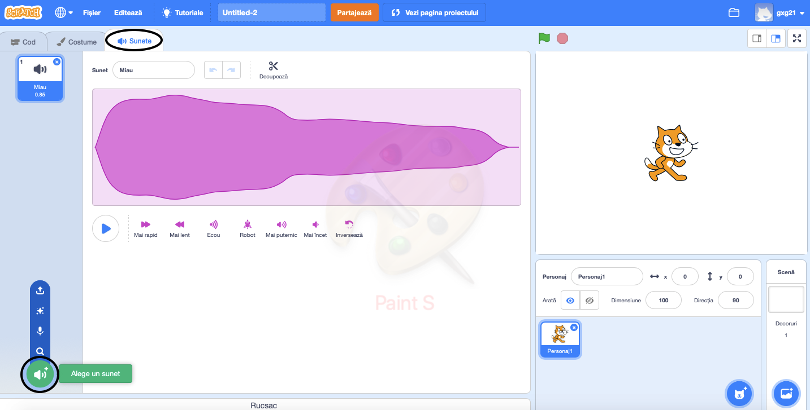
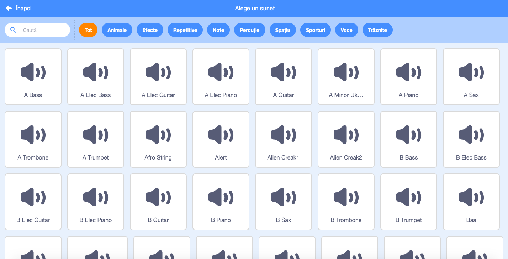
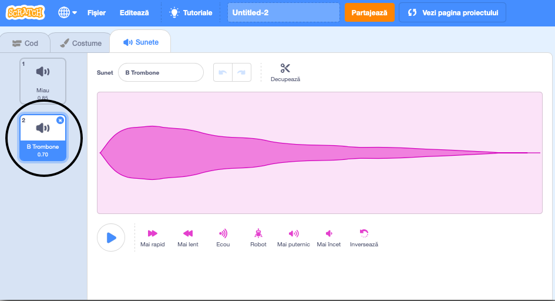

+ Selectează personajul căruia dorești să-i asociezi sunetul.

+ Dă clic pe tab-ul **Sunete**, și apoi dă clic pe **Alege un sunet**:

+ Sunetele sunt organizate pe categorii, și pentru a le reda, poți trece cu mouse-ul peste ele. Alege sunetul pe care îl dorești.

+ Apoi ar trebui să vezi că personajul are asociat sunetul ales de tine.

