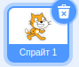

+ Выберите спрайт, к которому вы хотите добавить звук.

+ Перейди на вкладку **Звуки** и нажми кнопку **Выбрать звук**:

+ Звуки организованы по категориям и ты можешь навести курсор на значок, чтобы услышать звук. Выбери подходящий звук.

+ Далее ваш спрайт должен получить выбранный вами звук.

