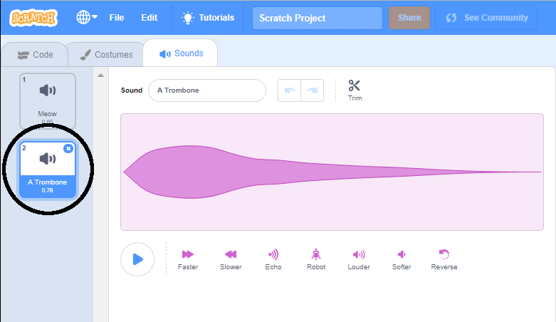

+ Vyber postavu, ktorej chceš pridať zvuk.

+ Klikni na kartu **Zvuky** a potom na tlačidlo **Vyber si zvuk**:

+ Zvuky sú usporiadané podľa kategórií a ak si chceš vypočuť zvuk presuň sa myšou na jeho ikonu. Vyber si vhodný zvuk.

+ Potom by si mal(a) vidieť, že tvoja postava má zvolený zvuk.

