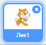
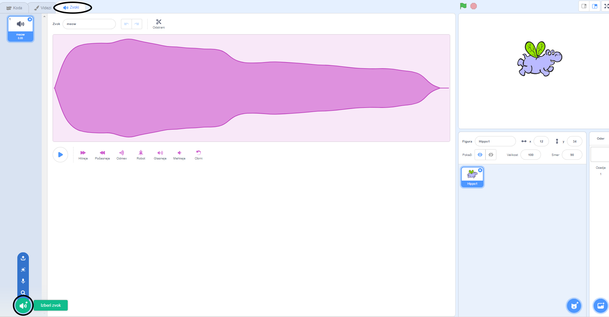
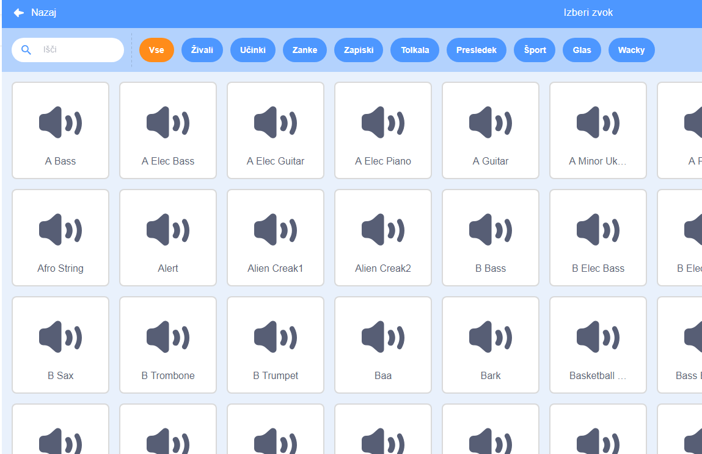
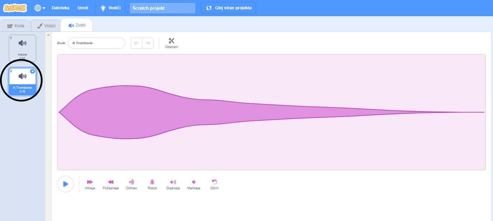

+ Izberi figuro, ki ji želiš dodati zvok.

+ Izberi zavihek **Zvoki** in klikni **Izberi zvok**:

+ Zvoki so organizirani po kategorijah. Če se pomakneš na ikono, lahko slišiš zvok. Izberi ustrezen zvok.

+ Potem bi moral videti, da ima tvoja figura zvok, ki si ga izbral.

