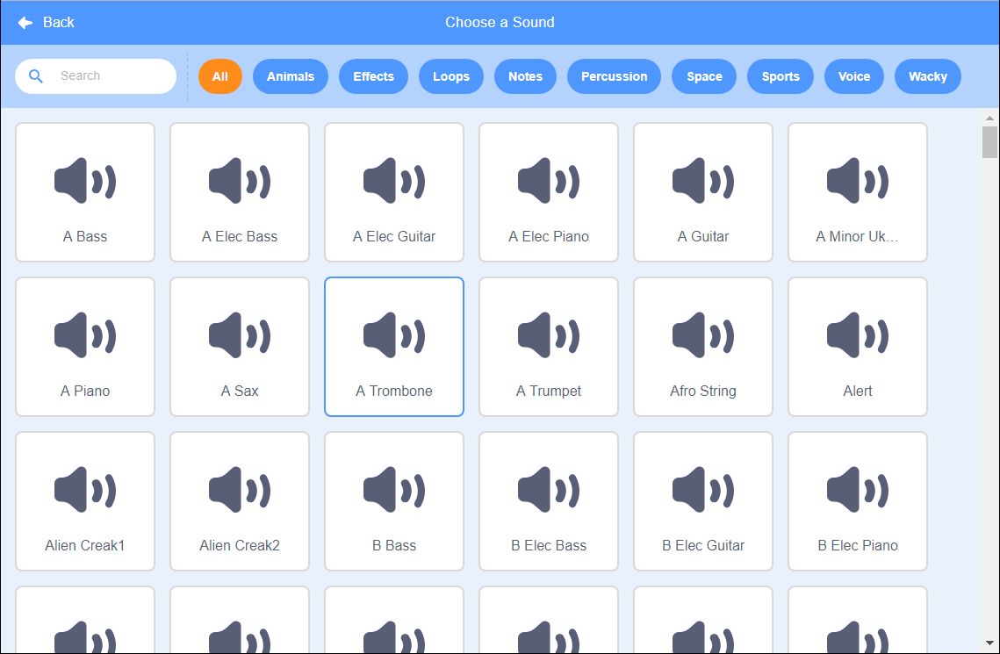

+ நீங்கள் ஒலியைச் சேர்க்க விரும்பும் ஸ்பிரிட்டை தேர்ந்தெடுக்கவும்.

+ **Sounds** தாவலைக் கிளிக் செய்து, **Choose a Sound** என்பதைக் கிளிக் செய்க:

+ ஒலிகள் வகைப்படி ஒழுங்கமைக்கப்பட்டுள்ளன, மேலும் ஒலியைக் கேட்க ஐகானின் மீது வட்டமிடலாம். பொருத்தமான ஒலியைத் தேர்வுசெய்க.

+ உங்கள் ஸ்பிரிட் நீங்கள் தேர்ந்தெடுத்த ஒலியைக் கொண்டிருப்பதை காண முடியும்.

