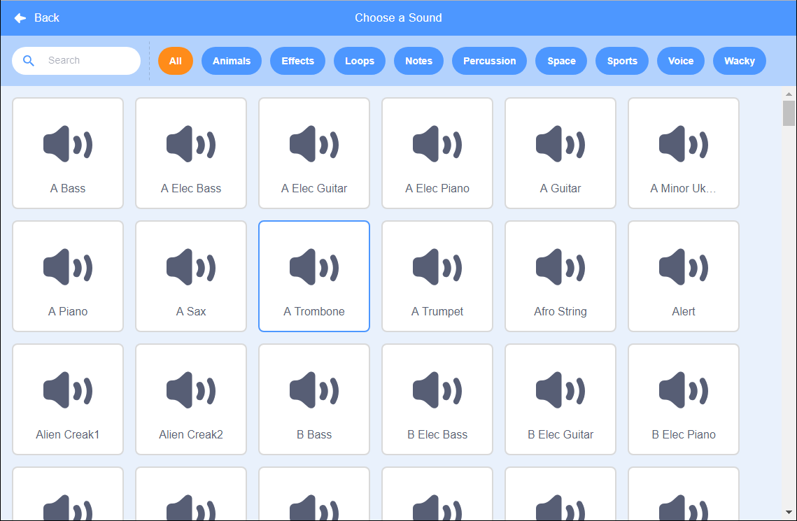

+ మీరు ధ్వనిని జోడించాలనుకుంటున్న sprite ని ఎంచుకోండి.

+ **Sounds** ట్యాబ్‌ని క్లిక్ చేసి, **Choose a Sound**ని ఎంచుకోండి:

+ Sounds కేటగిరీ వారీగా నిర్వహించబడతాయి మరియు మీరు ధ్వనిని వినడానికి చిహ్నంపై కర్సర్ ఉంచవచ్చు. తగిన ధ్వనిని ఎంచుకోండి.

+ మీ sprite లో మీరు ఎంచుకున్న ధ్వని ఉందో లేదో మీరు చూడాలి.

