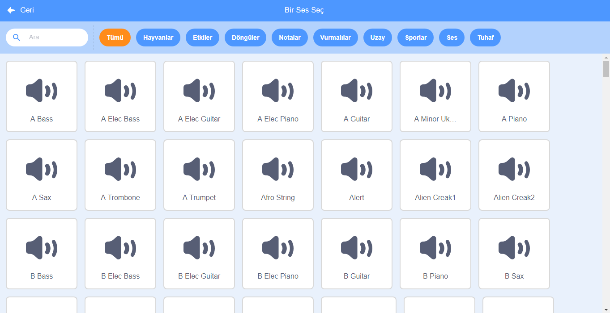

+ Ses eklemek istediğiniz kuklayı seçin.

+ **Sesler** sekmesine tıklayın, ardından **Bir Ses Seç** 'e basın:

+ Sesler kategoriye göre düzenlenir. Bir ses duymak için simgenin üzerine gelebilirsiniz. Uygun bir sesi seçin.

+ Ardından, kuklanızın seçtiğiniz sese sahip olduğunu göreceksiniz.

