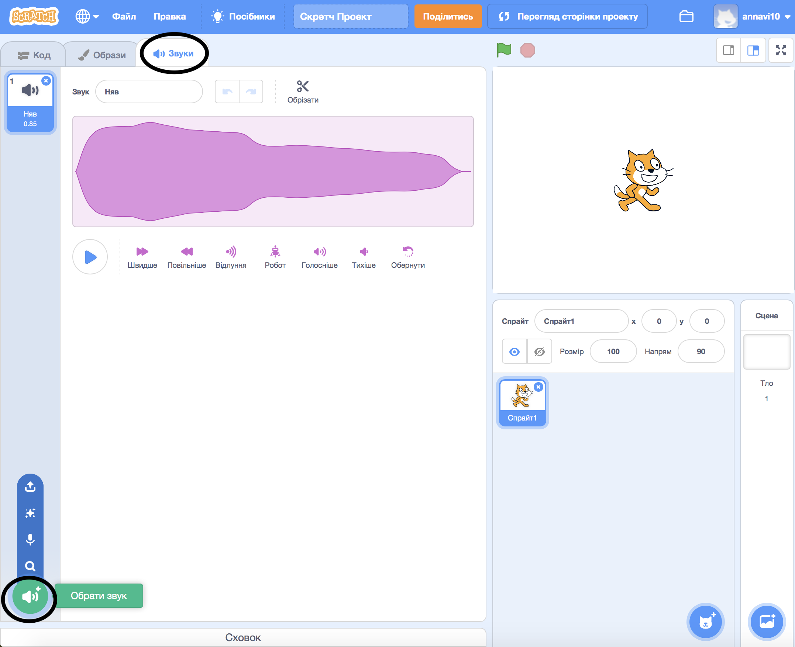
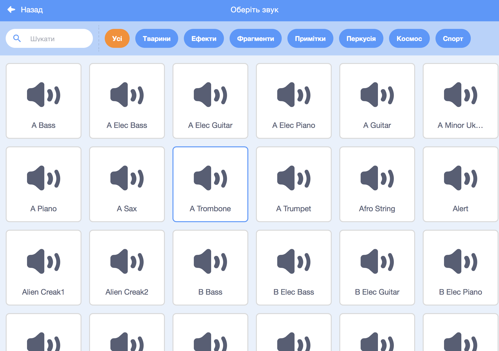
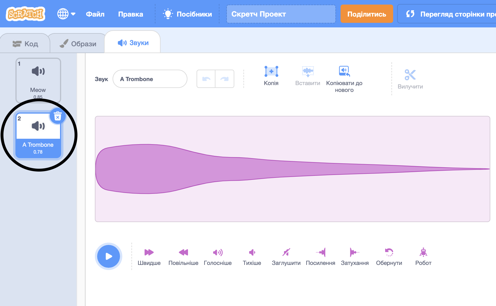

+ Вибери спрайт, до якого ти хотів (хотіла) б додати звук.

+ Натисни **Звуки**, та натисни **Обрати звук**:

+ Звуки організовані за категоріями і ти можеш навести курсор на піктограму, щоб їх почути. Вибери підходящий звук.

+ Потім ти маєш побачити, що твій спрайт має обраний звук.

