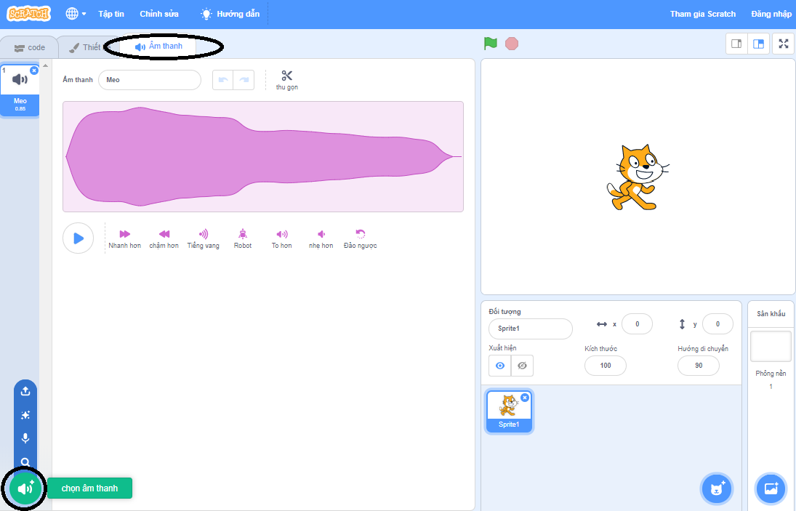
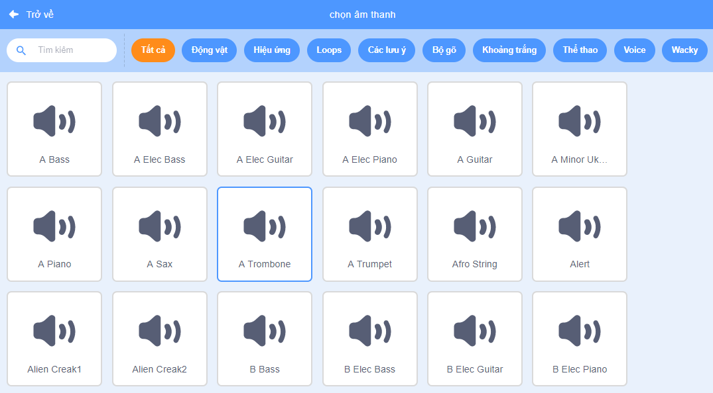
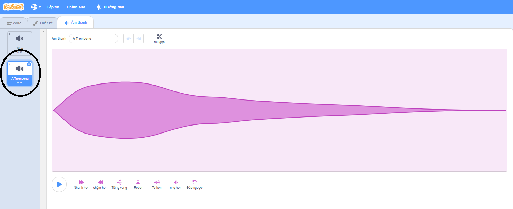

+ Chọn sprite bạn muốn thêm âm thanh vào.

+ Nhấp vào ** Âm thanh ** và nhấp vào ** Chọn âm thanh **:

+ Âm thanh được sắp xếp theo danh mục và bạn có thể di chuột qua biểu tượng để nghe âm thanh. Chọn một âm thanh phù hợp.

+ Sau đó bạn sẽ thấy rằng sprite của bạn có âm thanh được lựa chọn bởi bạn.

