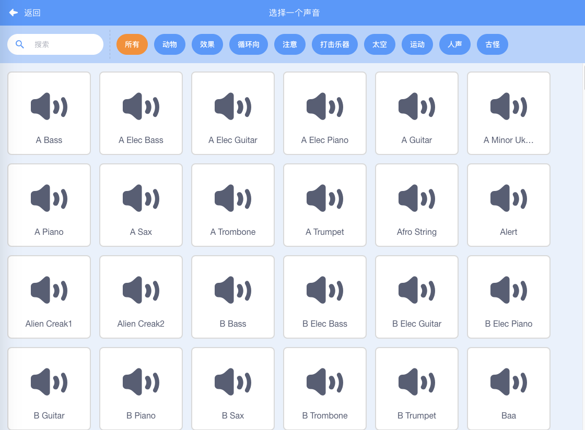
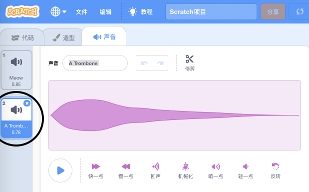

+ 选择你想要添加声音的角色。

+ Click the **Sounds** tab, and click **Choose a Sound**:

+ Sounds are organised by category, and you can hover over the icon to hear a sound. Choose a suitable sound.

+ 你应该能看到你的角色已经有了你给他选择的声音。

